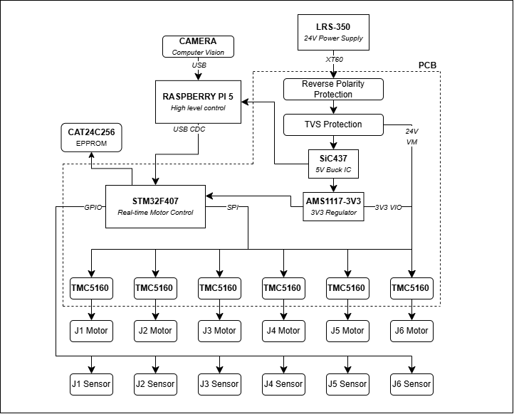
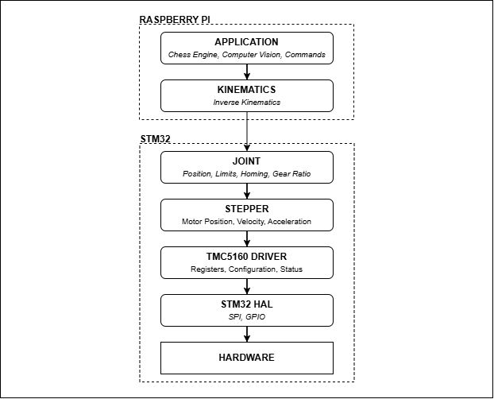
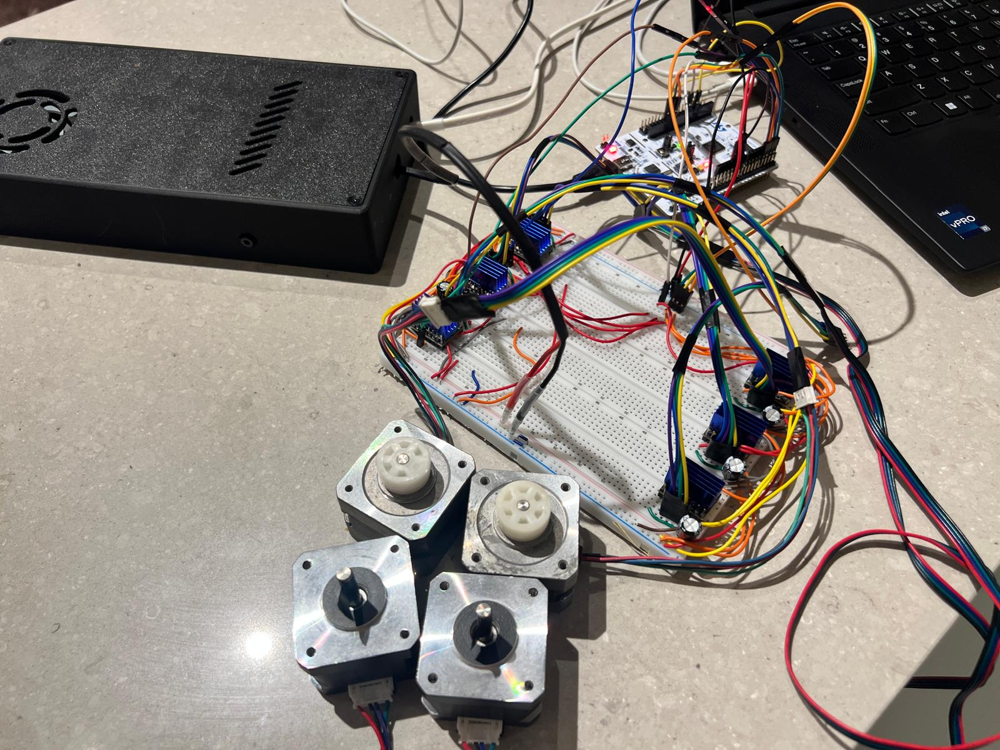
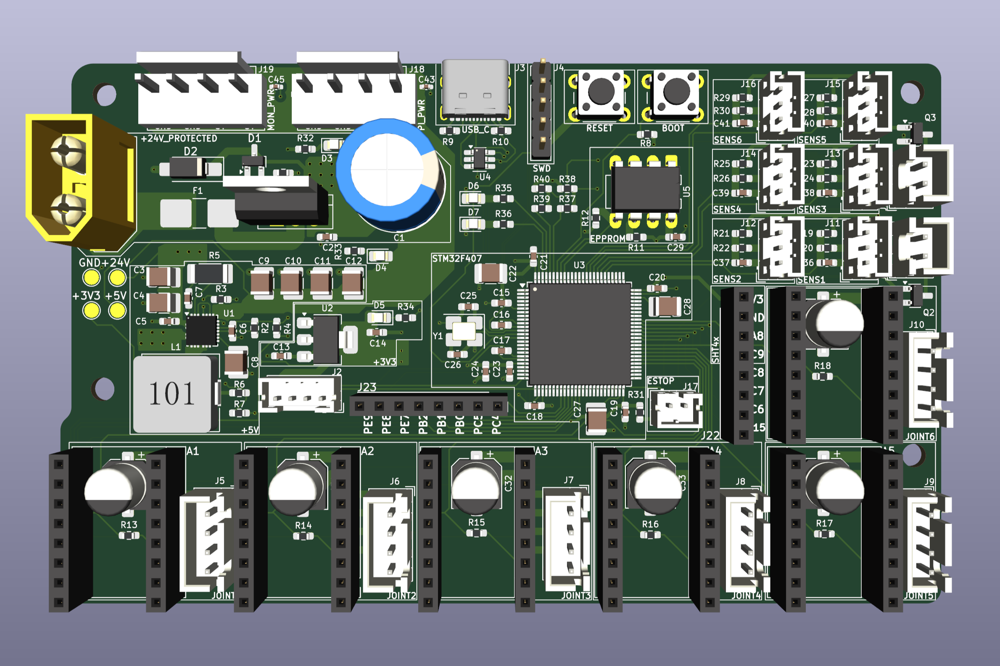
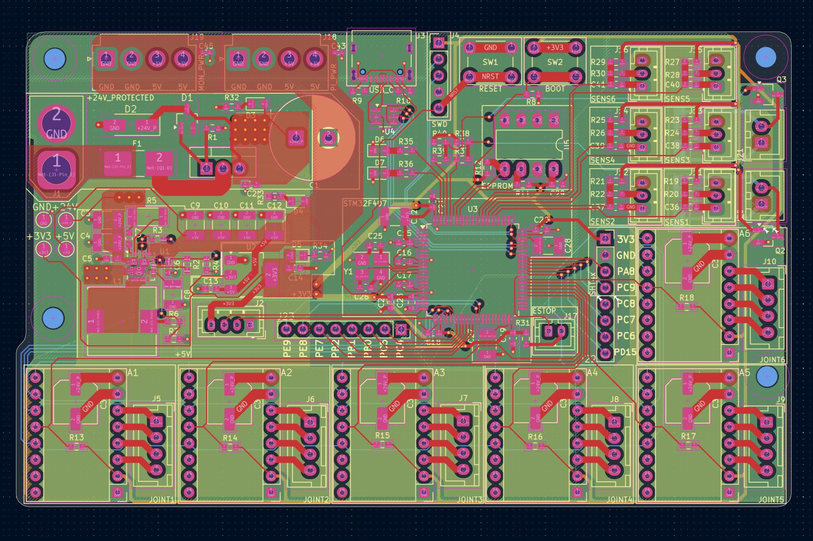
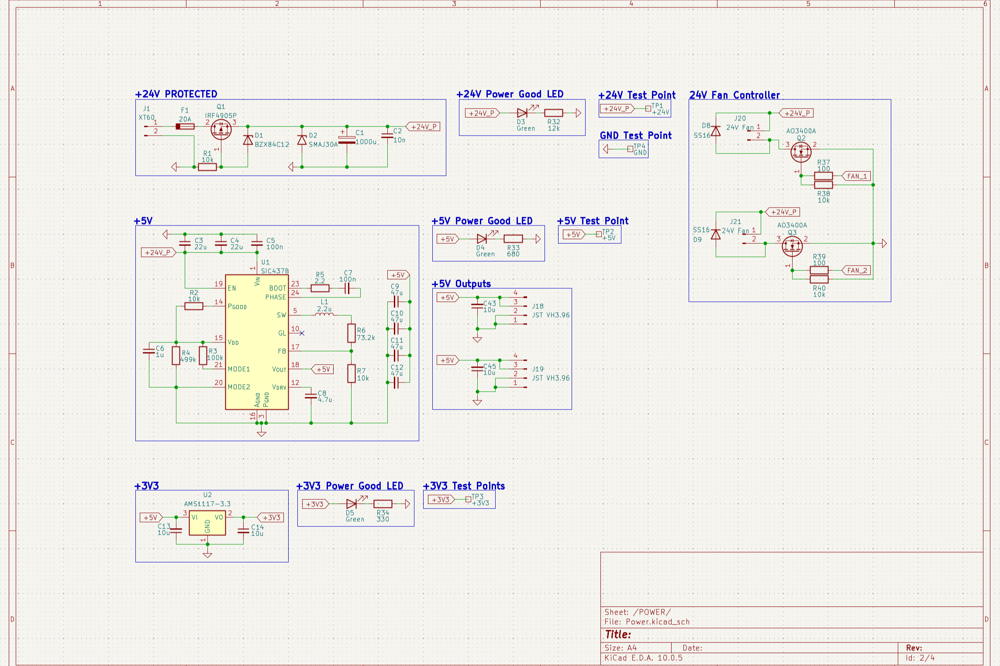
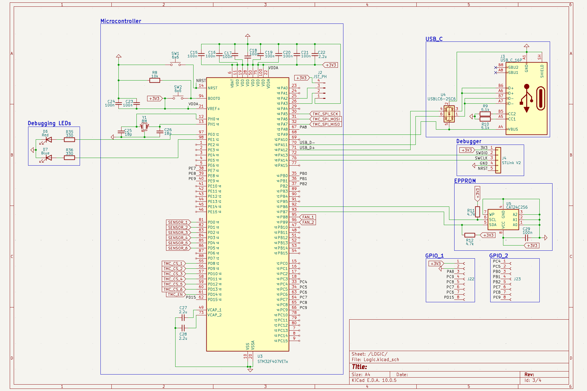
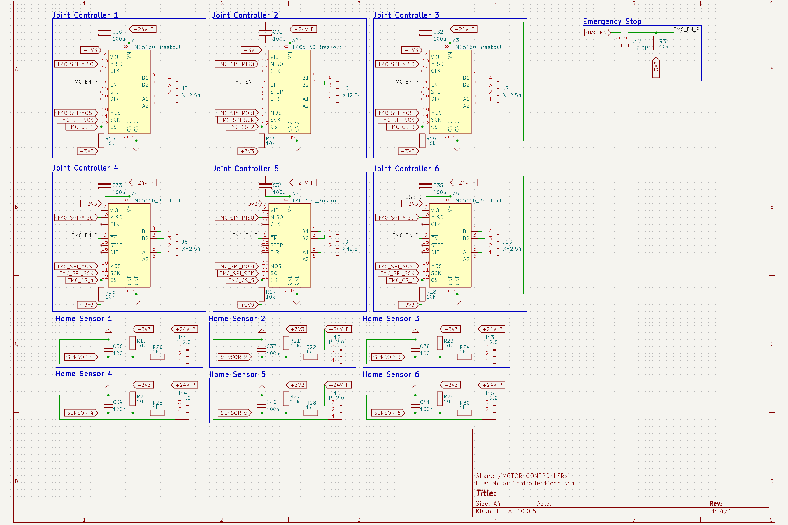

# STM32 CHESS ARM

A 6-DOF robotic arm designed to play physical chess.

## Status

Work in progress

## Project Overview

The project takes a pre-existing mechanical arm design and builds a custom electrical system and software stack around it to function as a chess player.

The goal of the project is educational, learning how each part of a robotic system works rather than getting the arm moving as quickly as possible. That shaped most of the design decisions.

The project covers firmware architecture, motion control, unit conversions, hardware debugging, PCB design, power distribution, and system integration.

## Architecture

  

## Firmware

The firmware is five layers. Each layer speaks in one set of units and never reaches past the layer directly beneath it:
 - The first layer is the [TMC5160 Drivers](https://github.com/andrewnguyen57/stm32-tmc5160-driver), it speaks directly to the driver's registers via SPI communication.
 - The second layer is the [Stepper Motor Driver](https://github.com/andrewnguyen57/stepper-motor-driver), it converts register values to scientific units for ease of use.

  

## Hardware
The custom control board is built around an STM32F407 and provides
motor-control interfaces, communication, sensing, and power distribution
for the robotic arm.
### Prototype Breadboard

  

### Control Board
Rev. 2

  
  

### Schematics

Power & Protection

  

MCU & Logic

  

Motor Control

  

### Key Components

| Part | Purpose |
|------|---------|
| STM32F407VET6 | Main MCU and real-time motion control |
| NEMA 17 | Stepper motors |
| TMC5160 | Stepper motor drivers |
| SiC437 | 24 V to 5 V buck converter |
| AMS1117-3.3 | 5 V to 3.3 V logic regulator |
| CAT24C256 | I²C EEPROM for calibration storage |
| SMAJ30A | TVS Diode 24 V input transient suppression |
| IRF4905 | MOSFET Reverse-polarity protection |
| BZX84C12 | Zener diode gate-source voltage clamp |
| 8 MHz crystal | HSE clock source |
| IRLML0060TRPBF | MOSFET fan control switching |
| SS16 | Diode fan controller protection  |
| Fuse | Input overcurrent protection |

## Mechanical Design

Mechanical design from [PAROL6](https://github.com/Source-Robotics/PAROL6-Desktop-robot-arm) (GPLv3). Firmware and control electronics are my own work.

See the [mechanical build process](mechanical/build-process.md) for details on assembling the arm.

## Related Projects

- [Stepper Motor Driver](https://github.com/andrewnguyen57/stepper-motor-driver)
- [TMC5160 Driver Library](https://github.com/andrewnguyen57/stm32-tmc5160-driver)
- [PAROL6 Desktop Robot Arm](https://github.com/Source-Robotics/PAROL6-Desktop-robot-arm)

## License

This project is licensed under the MIT License.